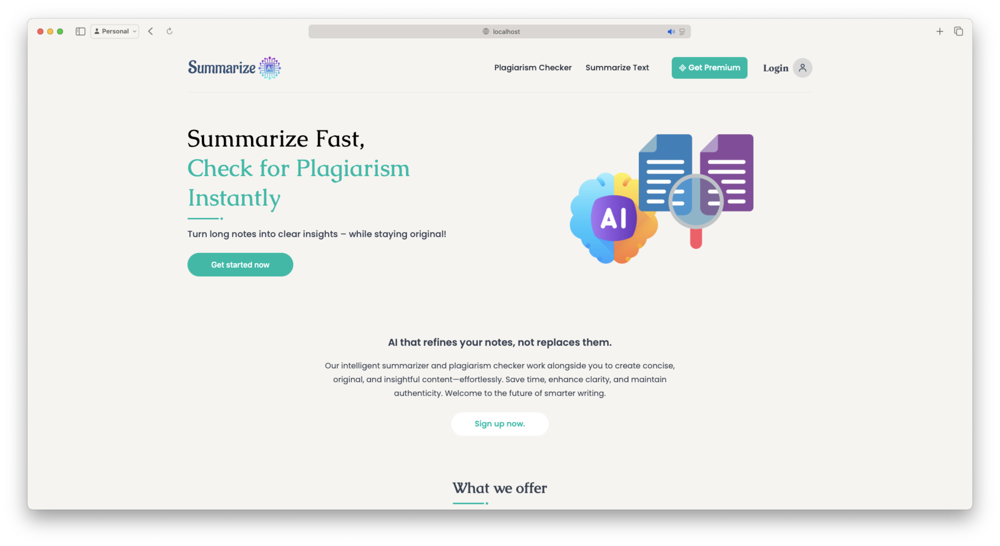
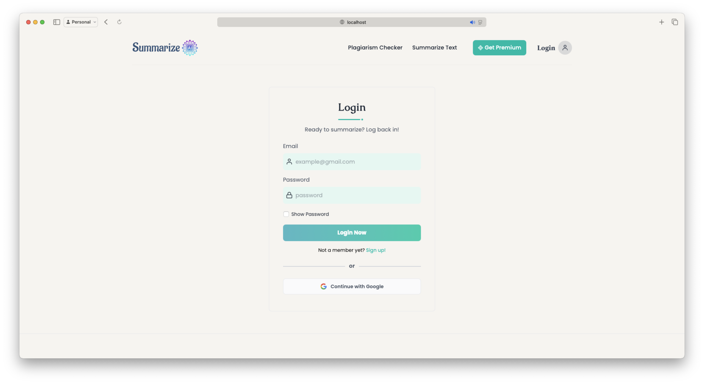
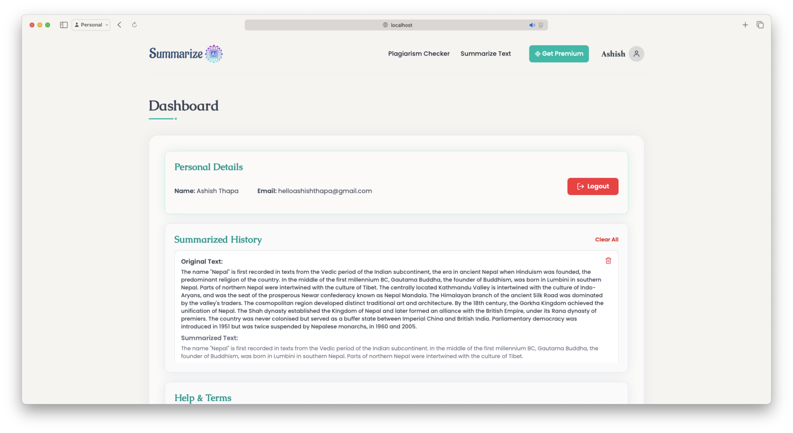

# SummarizeAi Documentation

## Overview
SummarizeAi is a full-stack AI-powered web application designed to help users summarize lengthy text content and detect plagiarism. It also provides a full-featured admin panel for managing users and tracking their summarization history.

---

## Features

### User Features
- Sign up and login with email/password or Google account
- Summarize text using BART-Large-CNN model
- Detect plagiarism using Google Search API + TF-IDF + Cosine Similarity
- View, delete, or clear summarization/plagiarism history
- Responsive UI with Tailwind CSS and animated components

### Admin Features
- Secure admin login
- View all registered users
- View each user's summarization history
- Delete users with confirmation prompts
- Separate admin dashboard

---
### Screenshots

## 🏠 Home Page


## 🔐 Login


## 🧠 User Dashboard



---

## Technologies Used

### Frontend
- React + Vite
- Tailwind CSS
- React Router
- Context API for Auth
- Lucide Icons, Framer Motion
- Google OAuth (`@react-oauth/google`)

### Backend
- Node.js + Express.js
- MongoDB with Mongoose
- Passport.js (Google OAuth)
- JWT for secure auth
- express-session, bcrypt, dotenv

### AI & NLP
- Hugging Face Transformers (BART-Large-CNN)
- Google Search API
- Custom TF-IDF + Cosine Similarity

---

## Project Structure

```
SummarizeAi/
├── client/                   # React frontend
│   ├── components/           # UI components/Page views (Login, Signup, Dashboard & others)
│   ├── context/              # Auth context
│   └── App.jsx               # Routing and layout
├── server/                   # Node/Express backend
│   ├── config/               # Passport, DB, dotenv
│   ├── controllers/          # All route logic
│   ├── middleware/           # Auth middleware
│   ├── models/               # Mongoose schemas
│   ├── routes/               # Express routes
│   └── server.js             # Server entry
```

---

## Setup Instructions

### 1. Clone the repository
```bash
git clone https://github.com/aasis-io/SummarizeAi.git
cd SummarizeAi
```

### 2. Configure environment variables
Create a `.env` file in the `server/` directory:
```env
PORT=5000
MONGO_URI=your_mongo_uri
JWT_SECRET=your_jwt_secret
GOOGLE_CLIENT_ID=your_google_client_id
GOOGLE_CLIENT_SECRET=your_google_client_secret
GOOGLE_SEARCH_API_KEY=your_search_api_key
GOOGLE_CSE_ID=your_custom_search_engine_id
```

### 3. Install dependencies
```bash
# Backend
cd server
npm install

# Frontend
cd ../client
npm install
```

### 4. Run the project
```bash
# Backend
cd server
npm start

# Frontend
cd ../client
npm run dev
```

---

## API Endpoints

### Auth Routes
- `POST /api/auth/register` — Register new user
- `POST /api/auth/login` — User login
- `GET /api/auth/google` — Initiate Google login
- `GET /api/auth/google/callback` — Google OAuth callback

### Summarize
- `POST /api/summarize` — Submit text to summarize

### Plagiarism
- `POST /api/plagiarism` — Check input for plagiarism

### User History
- `GET /api/history` — Get logged-in user's history
- `DELETE /api/history/:id` — Delete one history entry
- `DELETE /api/history/clear` — Clear all history

### Admin Routes
- `POST /api/admin-auth/login` — Admin login
- `GET /api/admin-auth/profile` — Get logged-in admin profile
- `GET /api/admin/users` — List all users
- `GET /api/admin/users/:id` — Get user by ID with history
- `DELETE /api/admin/users/:id` — Delete user

---

## Google Login Integration

### Frontend
In the Login page:
```js
const handleGoogleLogin = () => {
  window.location.href = "http://localhost:5000/api/auth/google";
};
```

### Backend
Set up Passport.js with Google strategy and express-session.
Configure routes `/api/auth/google` and `/api/auth/google/callback`.

---

## Deployment Tips
- Use Netlify/Vercel for frontend deployment
- Use Render or Railway for backend hosting
- Ensure environment variables are correctly set in each platform
- Configure CORS origins in the backend for frontend URL

---

## Credits

Developed by **Ashish Thapa**
- GitHub: https://github.com/aasis-io/

